# Lunch Break
## Tools Used
- SASS
- React
- React Hooks
- Node.js 
- Express
- Postman
- DBeaver
- pg SQL package
- bcrypt
- Heroku
- CSS
- PostgresSQL

## Setup
Clone the repository, run npm start and node src/server/server.js. The data base runs on heroku: it does not need to be downloaded locally.  

## Features

### Login Page
The user can login into an account or create a new one under the sign in fieldset.  
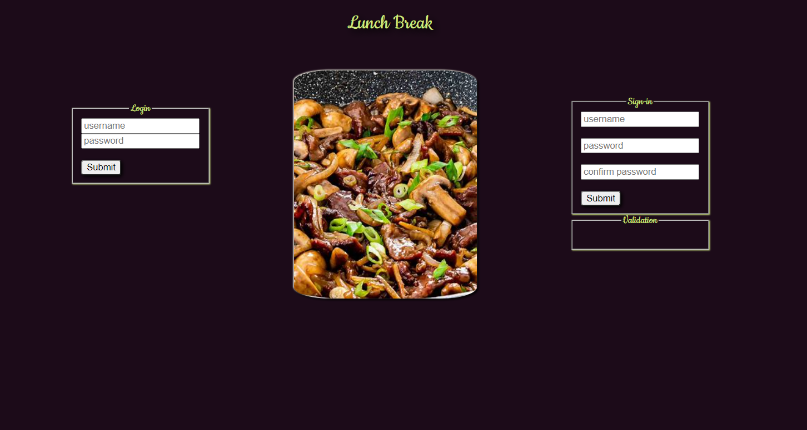  
Various Validation exists to prevent the user from creating an account with the same name, an empty username, shorter usernames and passwords
and if the confirm password doesn't match.  
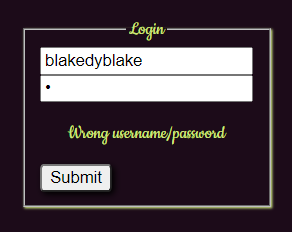  
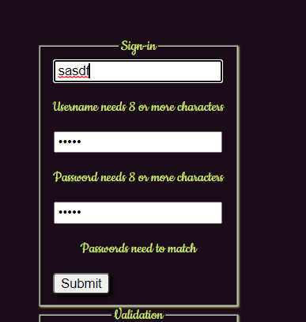  
  
Password data is encrypted to the users table on the Heroku database.  
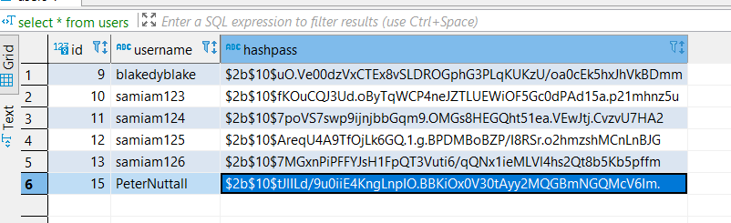  
### Main Page
The user can choose from a selection of the restaurants of the database in order of popularity. The left and right arrows toggle up and down the array.   
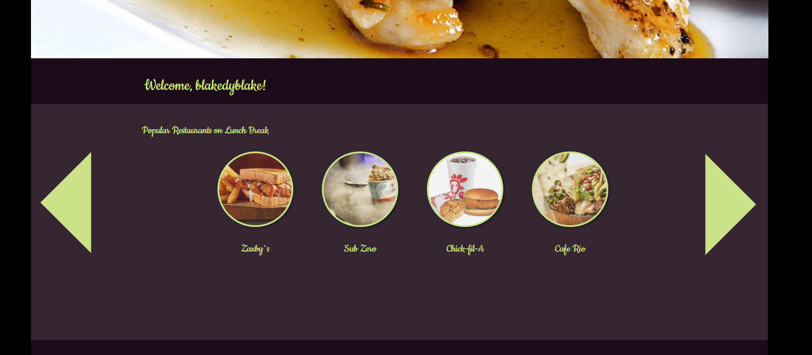  
There is a filter for the second selection for which types of food the user wishes to consume.  
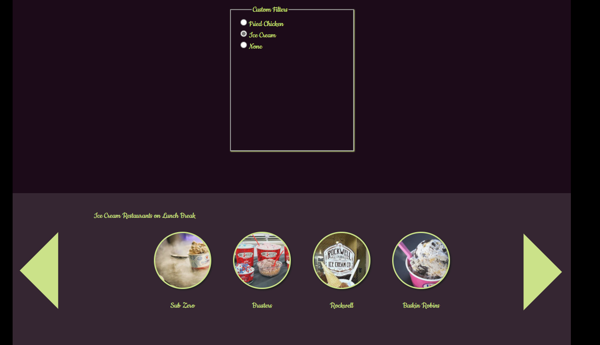  
The database for the restaurants, also clicking on the restaurants increases the popularity of that restaurant.  
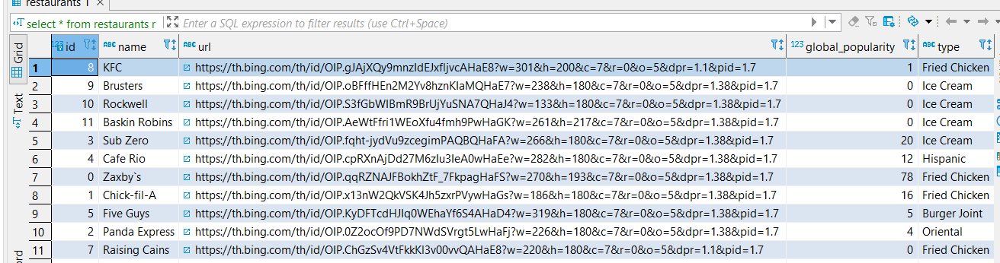  

### Menu Pages
Clicking on a restaurant of the main page takes the user to its Restaurant Page which presents the menu items from the database.  
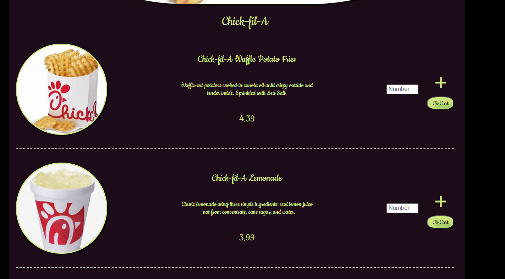  
The user can choose the Quantity and add the item to the cart. This sends an alert to show that it worked.  
Note: If the user adds the same item two different times, they do not come as separate rows on the current_orders table where the carts of all users are stored. Instead the new quantity is added to the old quantity. The To Cart button allows the user to see their cart.   
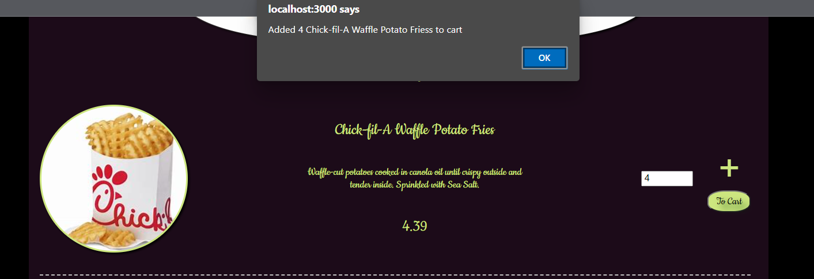  
The menu database where the food items of all restaurants are stored.
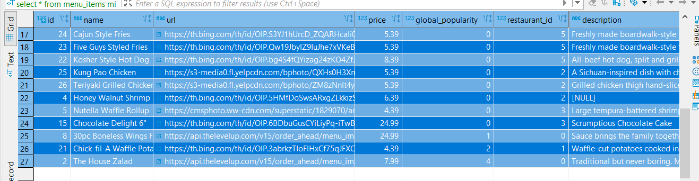  
### Cart Page
Presents all of the users cart from the current_orders table.  
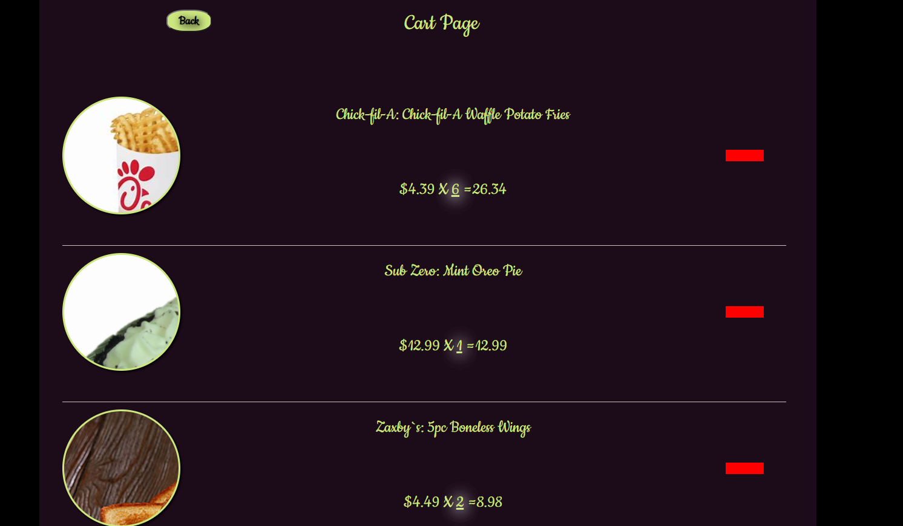  
The red button deletes that item from the cart, shown in the next render thanks to useEffect.  
The glowing part of the span exists to attract the users attention. Clicking on it allows the user to alter the quantity of what he/she ordered.  
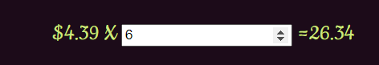  
Below the Cart list there is a cart total header and a Pay Now button.  
The cart total updates everytime the quantity is updated.  
The Pay Now button takes the user to the pay page.  
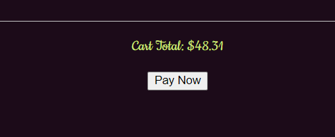  
The current_orders table:  
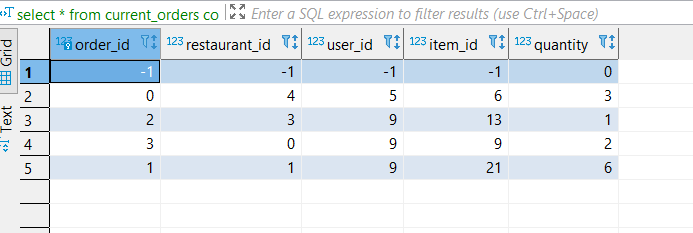  

### Pay Page and Success
Here the user can give his location and information necessary for the payment. Upon pressing the Pay button this information goes to the pay_info table.  
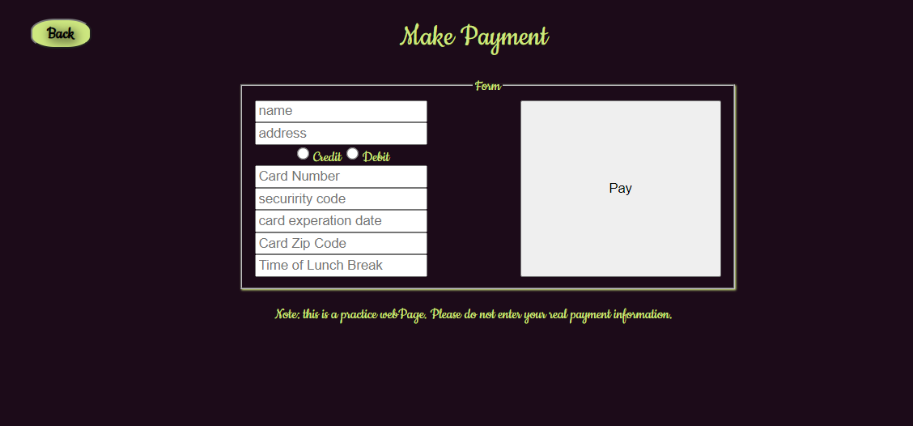  
Once the payment is successful the user is taken to a page that notifies them that the payment was successful.  
(No actual paying function takes place here, nevertheless please don't save your actual payment information on my database.)  
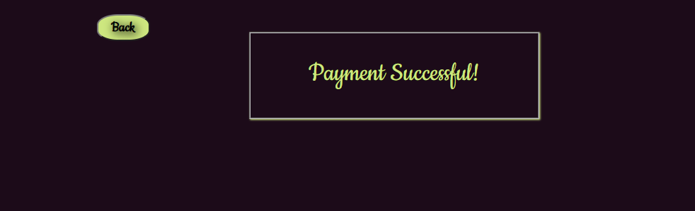  
The pay_info database(No Real informaiton here):  
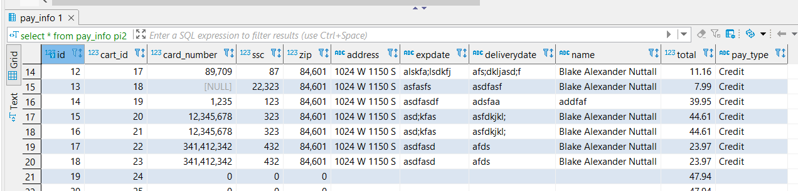 

#### Currently Working On: Validation
Should be finished pretty soon. Things like checking if the credit card is valid 

### Other Databases
Once the payment is submitted, the cart in current orders is deleted and the information is taken to two different tables: carts(which links cart_id to the user that made them) and confirmed_carts which has all of the orders from current_orders that got deleted. This will be utilized in a future Employee page that our employees will use to deliver the items from those carts  
  
The current carts database:  
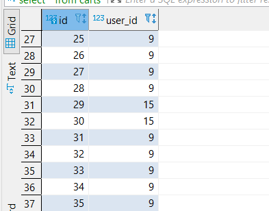    
The current comfirmed_carts database:  
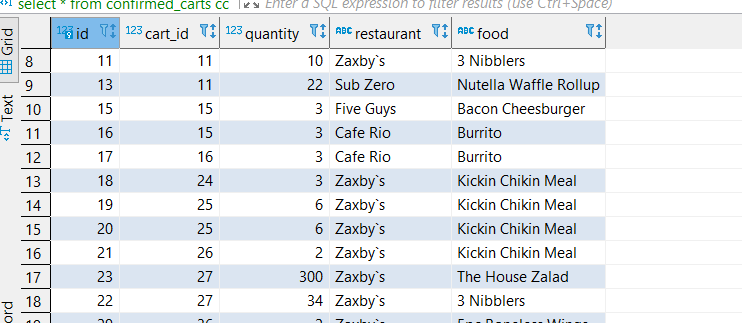 

## Future Features

### Media Queries
So that the site looks nice no matter what devices is using it.  
### New Restaurants/Filters
Add more restaurants and items to their menus. Maybe add some Vegan restaurants with a vegan filter.  
### Employee Page and Geolocation
Have it so that the users address given in the payment phase is calculated so that nearby employees can use this site to know which deliverys they have to do.  
### Flavors
Sometimes the same item comes in a variety of Flavors. This would alter the layout of menu components. What about drinks that come with meals?  
