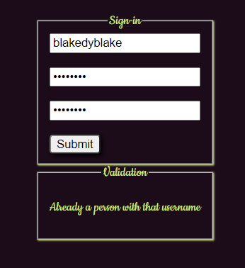

# Lunch Break

## Features
## Setup
Clone the repository, run npm start and node src/server/server.js. The data base runs on heroku: it does not need to be downloaded locally.  

### Login Page
The user can login into an account or create a new one under the sign in fieldset.  
  
Various Validation exists to prevent the user from creating an account with the same name, an empty username, shorter usernames and passwords
and if the confirm password doesn't match.  
  
  
  
Password data is encrypted to the users table on the Heroku database.
  
### Main Page
The user can choose from a selection of the restaurants of the database in order of popularity. The left and right arrows toggle up and down the array.   
  
There is a filter for the second selection for which types of food the user wishes to consume  
  
The database for the restaurants, also clicking on the restaurants increases the popularity of that restaurant  
  

### Menu Pages
Clicking on a restaurant of the main page takes the user to its Restaurant Page which presents the menu items from the database.  
  
The user can choose the Quantity and add the item to the cart. This sends an alert to show that it worked.  
Note: If the user adds the same item two different times, they do not come as separate rows on the current_orders table where the carts of all users are stored. Instead the new quantity is added to the old quantity. The To Cart button allows the user to see their cart.   
  
The menu database where the food items of all restaurants are stored
  
### Cart Page

### Pay Page and Success

## Future Features

### Media Queries

### New Restaurants/Filters

### Employee Page and Geolocation

### More Restaurants and Food

### Flavors

